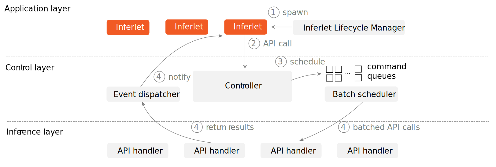

# Overview

**Pie** is a **programmable system for LLM serving**. Pie lets you *program* the serving loop itself, not just send a prompt and wait. That shift makes today's agentic apps and complex reasoning strategies both **easier** to build and **faster** to serve.

---

## Accelerate your AI apps with Pie

**Fast.** Cut end‑to‑end latency and boost throughput by using application‑aware optimization with integrated I/O and fine‑grained KV‑cache control. (*Measured on Llama 3.2 1B using L40 GPU*)


**Flexible.** Compose APIs to implement custom decoding, resource policies, and per‑request optimizations—without patching or forking your serving stack.


---

## What is programmable serving?

Existing LLM serving systems run a **single monolithic decode loop** with global policies (e.g., cache management, speculative decoding). **Pie** splits this into **fine‑grained handlers**—embed, forward, sample, KV‑page alloc/free, etc.—and lets your **inferlets** define custom decoding logic and application‑specific resource management.


Inferlets compile to **WebAssembly**, so you can write them in **Rust**, **C++**, **Go**, and more.

---

## Why programmable serving?

Modern LLM apps demand LLM usage beyond simple text completion. They're interactive, non-linear, and tool-heavy. Current LLM serving systems struggle with three limitations:

- **Inference inefficiency** from missing application-level optimizations
- **Integration friction** with the external data and tools
- **Implementation challenges** for the custom generation workflows

**Pie** addresses all three:

1. **Application-specific KV control.** Keep, reuse, split, or drop KV cache pages *based on your workflow* (trees/graphs of thought, multi-step plans, map–reduce summaries).
2. **Integrated computation & I/O.** Call APIs or run code, **without** extra round-trips and re-prefills.
3. **Custom generation processes.** Mix speculative/assisted decoding, MCTS, grammar constraints, safety filters, watermarking at the user level, without modifying the serving system.

---

## How Pie works

**1) Write inferlets** with Pie APIs to control LLM resources (KV, embeddings), run inference (embed, forward, sample), and do lightweight I/O (HTTP, message bus).

```rust
use inferlet::stop_condition::{StopCondition, ends_with_any, max_len};
use inferlet::{Args, Result, Sampler, get_auto_model};

#[inferlet::main]
async fn main(mut args: Args) -> Result<String> {

    let model = get_auto_model();
    let mut ctx = model.create_context();

    ctx.fill_system("You are a helpful, respectful and honest assistant.");
    ctx.fill_user("How are you?");

    let sampler = Sampler::top_p(0.6, 0.95);
    let stop_cond = max_len(max_num_outputs).or(ends_with_any(model.eos_tokens()));

    let final_text = ctx.generate(sampler, stop_cond).await;

    Ok(final_text)
}
```

**2) Compile to Wasm.** Inferlets build into reusable **Wasm** binaries.

**3) Submit to the Pie server.** The server hosts and runs inferlets in a sandboxed Wasm runtime. Submit binaries via Python/JavaScript APIs or CLI, with custom args as needed. You can also interactively communicate with running inferlets.

---

## System Architecture

Pie is a three-layered system where each layer separates concerns.



| Layer | Responsibility |
|-------|----------------|
| **Application** | Your inferlet runs in sandboxed Wasm runtime |
| **Control** | Virtualizes resources (KV cache page, embeddings), manages batch scheduler |
| **Inference** | Executes batched API calls on GPUs |

---

## Client Libraries

Pie provides client libraries for:
- **Python** — `pip install pie-client`
- **JavaScript** — `npm install @pie-project/client`
- **Rust** — `cargo add pie-client`

See the [Client API](/docs/client-api/python) documentation for details.

---

## Standard Inferlets

Pie includes standard inferlets for common use cases:

| Inferlet | Description |
|----------|-------------|
| `std/text-completion` | Simple text completion |
| `std/chat` | Multi-turn chat with system prompts |

Run them directly:
```bash
pie run text-completion -- --prompt "Once upon a time"
pie run chat
```

---

## Further Reading

- Our [HotOS 2025 paper](https://ingim.org/papers/gim2025serve.pdf) motivates the vision that LLM serving systems are operating systems.
- Our [SOSP 2025 paper](https://ingim.org/papers/gim2025pie.pdf) details the design and implementation of Pie.

## Next Steps

- Follow the [Tutorial](/docs/tutorial/quickstart) to build your first app
- Explore the [CLI Reference](/docs/cli) for all commands
- Read the [Client API](/docs/client-api/python) docs
